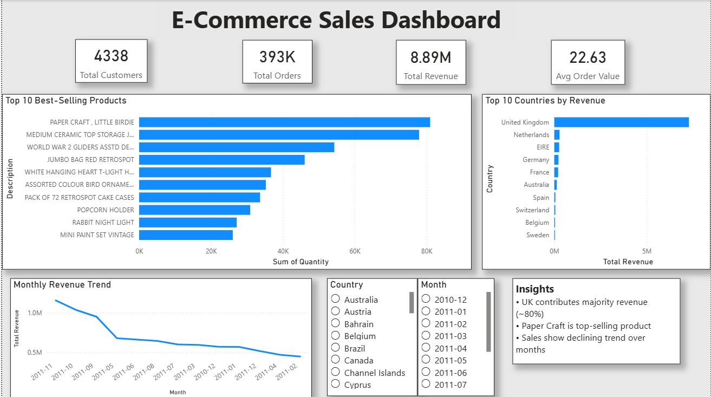

# 📊 E-Commerce Data Cleaning & Sales Analysis

## 🚀 Project Overview

This project focuses on cleaning and analyzing a real-world e-commerce dataset to extract meaningful business insights. The goal was to transform raw, messy data into a structured format and build an interactive dashboard for decision-making.

---

# ▶️ How to Run

1. Clone the repository
2. Install dependencies:
   pip install -r requirements.txt
3. Run cleaning:
   python cleaning.py
4. Run analysis:
   python analysis.py

## 🧹 Data Cleaning (Excel + Python)

* Removed invalid transactions (negative quantity, zero price)
* Handled missing values (CustomerID)
* Eliminated duplicate records
* Standardized data formats
* Created a new feature: **Revenue = Quantity × UnitPrice**

📉 Dataset reduced from **541,909 → 392,693 rows (~27% cleaned)**

---

## 🐍 Tools & Technologies

* Python (Pandas)
* Excel
* Power BI

---

## 📊 Dashboard Features

* **Top 10 Best-Selling Products**
* **Top 10 Countries by Revenue**
* **Monthly Revenue Trend**
* KPI Metrics:

  * Total Revenue
  * Total Orders
  * Total Customers
  * Average Order Value

---

## 📈 Key Insights

* 🇬🇧 United Kingdom contributes ~80% of total revenue
* 🥇 "Paper Craft" is the top-selling product
* 📉 Sales show a declining trend over time

---

## 📂 Project Structure

```
Ecommerce-Data-Cleaning/
│── data/
│   └── raw_data.xlsx
│── output/
│   └── cleaned_data.csv
│── cleaning.py
│── analysis.py
│── dashboard.png
│── README.md
```

---

## 💼 Business Impact

This project demonstrates how data cleaning and analysis can improve data quality and support better business decisions by identifying high-performing products, markets, and trends.

---

## 📸 Dashboard Preview



---

## 🙌 Author

Sourav Sarkar

